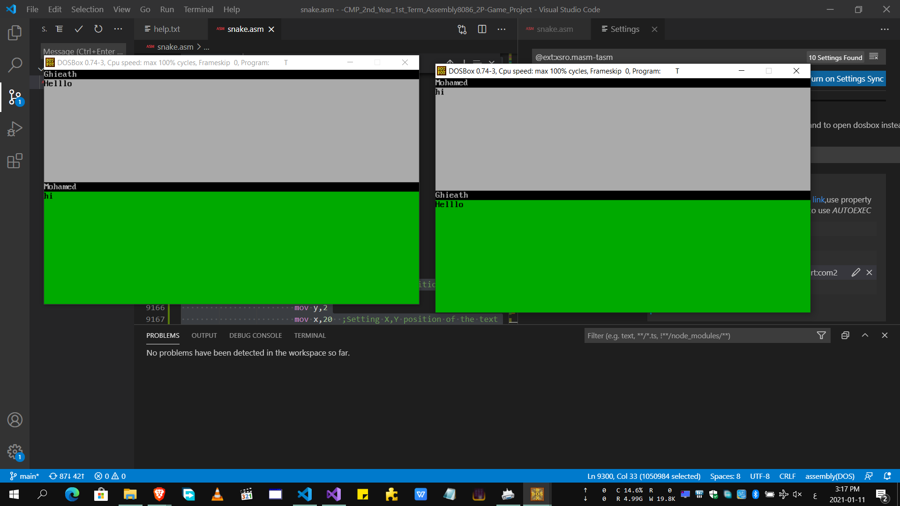
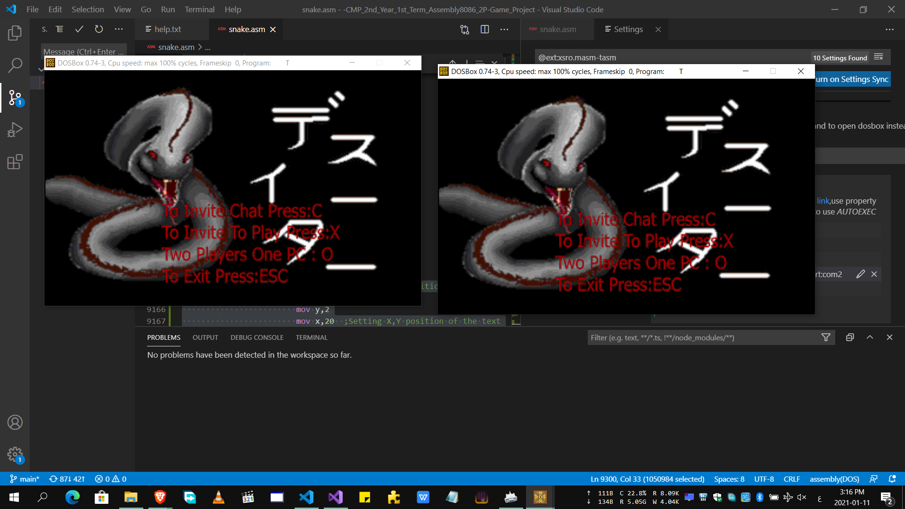
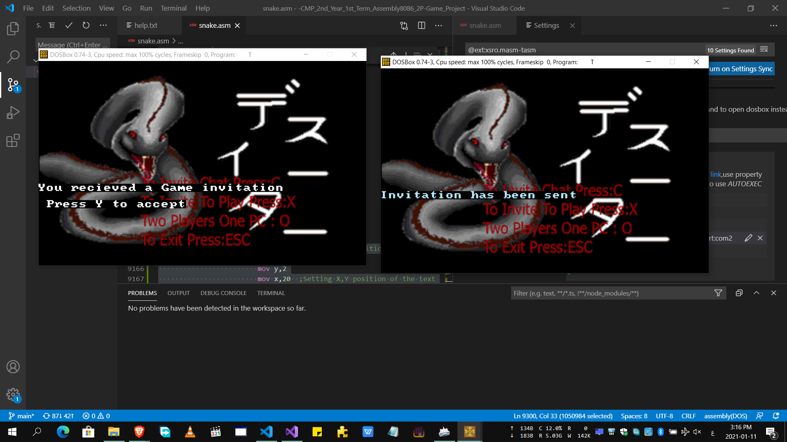
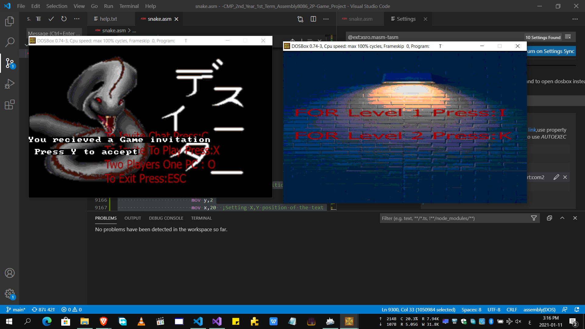
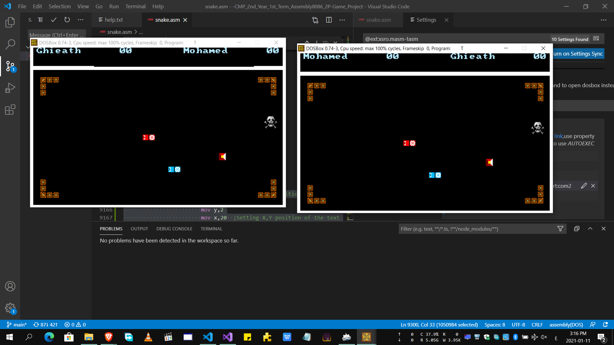
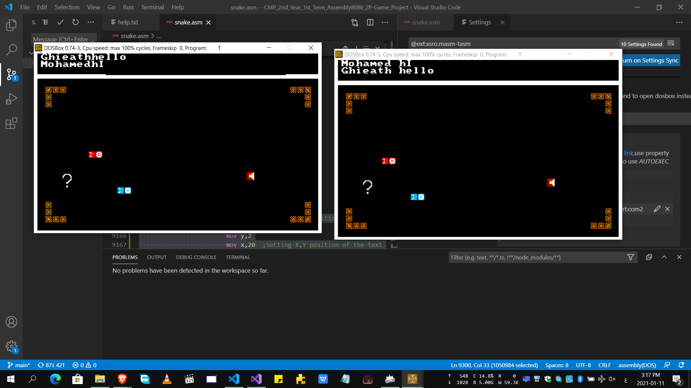

# Snake Fight x86
Assmebly 8086 Two-Player Game (Both One PC and Two PCs!)

## Table of Contents
- [Chat Preview](#Chat)
- [Main-Menu Preview](#Main-Menu)
- [Game Preview](#Game)
- [Software Used](#Software Used)
- [Contributors](#Contributors)

## Chat

## Main-Menu
### Idle:

### Sending Invitation:

### Accepting Invitation:

## Game

### In-Game Chat

## Note:-
-Two PCs Gameplay Requires Serial Port Communication.

## Software Used
- VsCode
- MASM/TASM Extension for VsCode
- Virtual Serial Port Driver By Eltima

## Contributors
- https://github.com/GhiathAjam
- https://github.com/mhmdahmedfathi
- https://github.com/Omar-ahmed314
- https://github.com/MostafaAhmedSabra2

